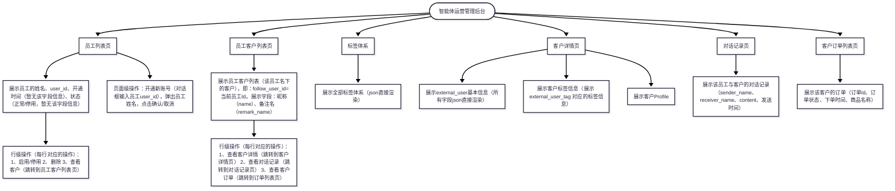

```mermaid
---
config:
  theme: redux
  layout: dagre
  look: neo
---
flowchart TD
    A01(["智能体运营管理后台"]) --> B01 & B02 & B03 & B04 & B05 & B06
    B01["员工列表页"] --> C01["展示员工的姓名、user_id、开通时间（暂无该字段信息）、状态（正常/停用，暂无该字段信息）"] & C02["页面级操作：开通新账号（对话框输入员工user_id），弹出员工姓名，点击"确认/取消""]
    B02["员工客户列表页"] --> C03["展示员工客户列表（该员工名下的客户），即：follow_user_id=当前员工Id。展示字段：昵称（name）、备注名（remark_name）"]
    B03["标签体系"] --> C04["展示全部标签体系（json直接渲染）"]
    B04["客户详情页"] --> C05["展示external_user基本信息（所有字段json直接渲染）"] & C06["展示客户标签信息（展示 external_user_tag 对应的标签信息）"] & C07["展示客户Profile"]
    B05["对话记录页"] --> C08["展示该员工与客户的对话记录（sender_name、receiver_name、content、发送时间）"]
    B06["客户订单列表页"] --> C09["展示该客户的订单（订单Id、订单状态、下单时间、商品名称）"]
    C01 --> D01["行级操作（每行对应的操作）：1、启用/停用 2、删除 3、查看客户（跳转到员工客户列表页）"]
    C03 --> D02["行级操作（每行对应的操作）：1、查看客户详情（跳转到客户详情页） 2、查看对话记录（跳转到对话记录页） 3、查看客户订单（跳转到订单列表页）"]
```